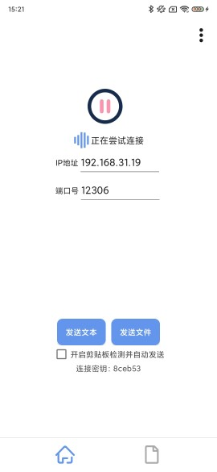
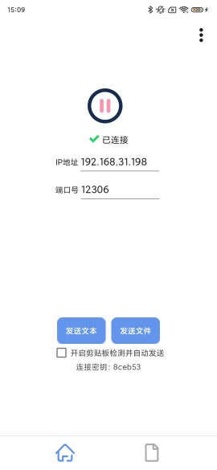
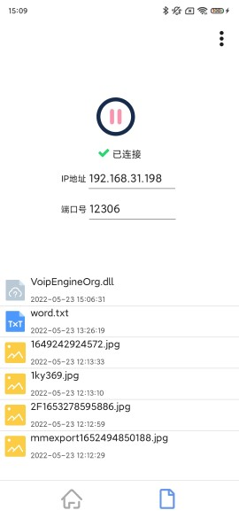
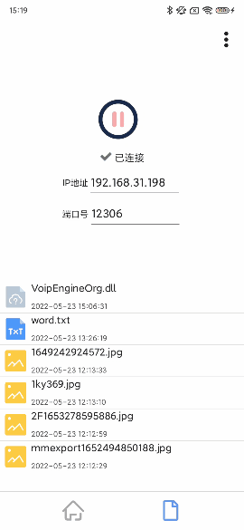

# ShareOnLan

**简介：**
Windows Connect With Android 
Windows平台与安卓在局域网下互传、发送文本、文件的小工具 
包括Windows端的exe和Android端的app

***

# 功能

- PC与Android设备互传
- PC与PC互传

---

## 开发平台与工具

Windows端是基于QT开发的一个GUI程序

Android端是基于Android Studio开发的app
***

## 运行原理&设计思路

对于PC设备A和Android设备A来说，PC设备A和Android设备A只能看到路由器A，Android设备B所在的那一层对于前面说的两个设备来说是内网设备而不可见（因为Android设备B所在的网络是属于路由器A的子网），这也就是为什么你在外面用移动数据不能直接连接家里的没有公网ip的设备了(想连接的话可以用内网穿透工具如frp）。

***

## 运行流程

**正常流程：**  

1. 由Windows端向所在局域网(LAN)广播UDP包，UDP payload包含PC端的IP、端口号、链接密钥（经过简单加密）。  
2. Android端监听UDP广播包，然后解密payload，验证密钥是否正确：若密钥正确，将IP和端口号填在app的对应输入框里，否则不予置理。  
3. Android的监测线程会每隔数秒自动尝试发起TCP连接（本文中暂且称之为“控制链路”），连接至由IP输入框和端口号输入框指定的主机。  
4. 连接成功后，安卓端监测线程停止，UDP监听线程停止。PC端会每隔一段时间通过“控制链路”向Android端发送一条"连接控制消息"（向Android端表明PC端还活着），Android收到后也会通过“控制链路”回应一条"连接控制消息"（向PC端表明Android端还活着）。  
5. 若双方在一个超时时间周期内没有收到对方发来的"连接控制消息"，则认为对方因不可抗力已离线，主动关闭连接。Android端更新界面、监测线程会重新开始运行、UDP监听线程也会重新开始监听；PC端更新托盘Tooltips信息。（因不可抗力可能发生这样的情况：其中一方离线，但另一方还保留了控制链路的socket，全然不知道发生了什么，以为对方还在）  
6. 发送文本：通过控制链路传输文本消息（理论上应该另开一条TCP连接较好）
7. 发送文件：每当文件发送时都会新建一条TCP连接发送文件

**一般流程(Android端无法接收Windows端发送的UDP报文)：**

1. 查看PC端程序的托盘Tooltip(提示消息)上的IP和端口号
2. 用户输入PC端的IP和端口
3. 本步骤及以下同**正常流程**  
4. ..

***

## 运行实例

### PC端

#### 主界面

  

- **连接密钥**：是从安卓端的主界面获取的（作用是自动连接时验证是不是你的PC，如果手动输入IP和端口号的话可以忽略它
- **监听端口**：指定PC在哪个端口监听（可以自定义，范围：1025~65533）
- **开机自启**：注册到注册表项中开机自启
- **启动时隐藏此界面**：不显示此界面，不过还有托盘（双击托盘恢复
- **文件保存路径**：可以自定义保存文件的目录

***

#### PC端托盘菜单

  

- **发送文本**：点击会自动发送剪贴板里的内容，Android端的剪切板上就会被设置上相同的内容
- **发送文件**：点击后选择文件发送
- **连接信息**：查看托盘信息的完整版（附带IP信息
- **重启服务**：软件不好使的时候试试哦，有奇效（依据的是[鸵鸟算法](https://baike.baidu.com/item/%E9%B8%B5%E9%B8%9F%E7%AE%97%E6%B3%95/4342932?fr=aladdin)
- **连接至**：连接至其他PC
- **设置**：显示设置界面
- **退出**：安详的退出了

***

#### PC端托盘菜单的ToolTip

如果PC上有多个网卡是有效的，会显示多行的 **IP:xx.xxx.xx.xxx**

***

#### PC端文件接收设置

***

### Android端

#### Android端界面介绍

|             Android端未连接/正在连接界面             |                Android端已连接界面                |                 Android端接收到的文件                  |
| :--------------------------------------------------: | :-----------------------------------------------: | :----------------------------------------------------: |
|  |  |  |
|         点击正中间的按钮会改变并提示当前状态         |          此时点击正中间的按钮会关闭连接           |                                                        |

***
#### Android端部分功能演示

|                 Android端处理接收到的文件                  | 安卓端发送文件到PC端（选择其他应用打开/分享 → 选择Share On Lan） |
| :--------------------------------------------------------: | :----------------------------------------------------------: |
|  |  |
|       可以对接收到的文件进行【打开】和【分享】的操作       | 在Android端选择文件后，点击【其他方式打开】或【分享】，然后选择Share On Lan应用就可以发送了 |

***

## 注意事项

- 经测试，在PC与Android共同连接的路由器交换机特别繁忙时，传输文件会受到一定的影响，此时可以选择其中一方开热点让另一方连接。

  

